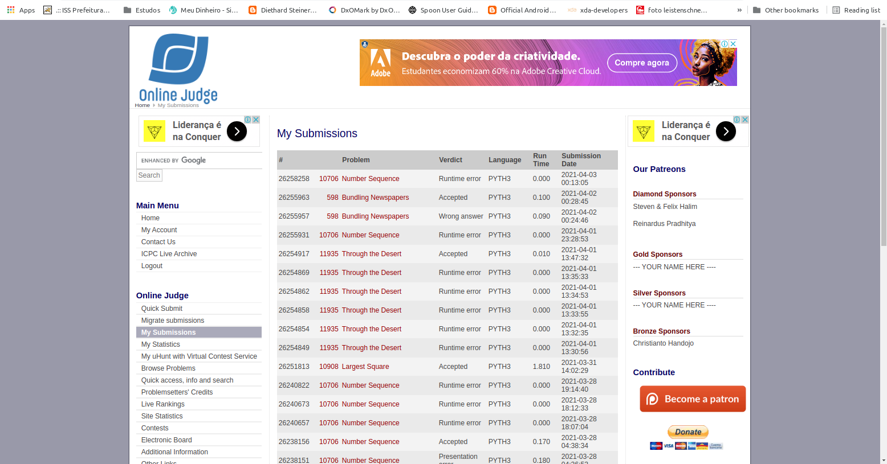

# Análise e Complexidade de Algoritmos

**Rodrigo Seidel**

**PPComp — Campus Serra, Ifes**

**2021-03**

## Breve explicação de como a técnica indicada foi utilizada
O número k para pesquisa pode ser agrupado em conjuntos de números, por exemplo:

[1] [1,2] [1,2,3] [1,2,3,4] [1,2,3,4,5] [1,2,3,4,5,6] [1,2,3,4,5,6,7] [1,2,3,4,5,6,7,8] [1,2,3,4,5,6,7,8,9] [1,2,3,4,5,6,7,8,9,10] [1,2,3,4,5,6,7,8,9,10,11] [1,2,3,4,5,6,7,8,9,10,11,12] ...

A partir daí, para identificar o dígito localizado na posição i temos que:

- primeiro determinamos o grupo de números ao qual esse dígito 'i' está associado;
- em seguida identificamos o dígito, buscando sua posição dentro do grupo localizado.

Para fazer isso, primeiro calculamos o comprimento de cada grupo de números.

1 --> 1

1 2 --> 2

1 2 3 --> 3

1 2 3 4 --> 4

1 2 3 4 5 --> 5

1 2 3 4 5 6 --> 6

1 2 3 4 5 6 7 --> 7

1 2 3 4 5 6 7 8 --> 8

1 2 3 4 5 6 7 8 9 --> 9

1 2 3 4 5 6 7 8 9 10 --> 11

1 2 3 4 5 6 7 8 9 10 11 --> 13

...

Depois calculamos a soma acumulada de cada um dos grupos de números.

A soma acumulada por cada grupo ajudará a identificar em que grupo está contido determinado 'i' pesquisado

1 --> 1

1 2 --> 3

1 2 3 --> 6

1 2 3 4 --> 10

1 2 3 4 5 --> 15

1 2 3 4 5 6 --> 21

1 2 3 4 5 6 7 --> 28

1 2 3 4 5 6 7 8 --> 36

1 2 3 4 5 6 7 8 9 --> 45

1 2 3 4 5 6 7 8 9 10 --> 56 (aqui o 10 conta 2 posições, chegando a 56, ou seja, é necessário considerar a quantidade de algarismos do número)

1 2 3 4 5 6 7 8 9 10 11 --> 69

1 2 3 4 5 6 7 8 9 10 11 12 --> 84

1 2 3 4 5 6 7 8 9 10 11 12 13 --> 101

1 2 3 4 5 6 7 8 9 10 11 12 13 14 --> 120

A técnica Dividir e Conquistar foi utilizada na busca binária realizada para se identificar dentro do objeto que armazena a soma acumulada de cada grupo. Identificada a posição, esta é expandida para que seja identificado o algarismo desejado.

Após submissão no Online Judge, o site apresentou "Runtime error", conforme imagem a seguir (primeiro item da lista). Porém o uDegug apresenta sucesso para diversos casos de teste e também para o segundo caso de teste do uDebug.
OBS.: o primeiro teste do uDebug não é válido pois a primeira linha (número de testes) deve respeitar a regra 1 ≤ t ≤ 25 e neste teste está informado 500.

Exemplos de testes locais corretos, com a saída correta, de acordo com o uDebug:

> 10
> 
> 23421
> 
> 3543245
> 
> 35443
> 
> 3490494
> 
> 424214832
> 
> 23904234
> 
> 2433094
> 
> 345324
> 
> 1123
> 
> 58894883

> 3
> 
> 1
> 
> 1
> 
> 9
> 
> 8
> 
> 6
> 
> 8
> 
> 2
> 
> 1
> 
> 0

#

> 16
> 
> 80 
> 
> 546 
> 
> 23423 
> 
> 65753 
> 
> 2345 
> 
> 45645756 
> 
> 546454 
> 
> 6786797 
> 
> 131231 
> 
> 78934124 
> 
> 68904565 
> 
> 123487907 
> 
> 5655 
> 
> 778888 
> 
> 101011 
> 
> 2147483647

> 0 
> 
> 2 
> 
> 3 
> 
> 1 
> 
> 5 
> 
> 5 
> 
> 2 
> 
> 5 
> 
> 9 
> 
> 7 
> 
> 5 
> 
> 7 
> 
> 1 
> 
> 5 
> 
> 5 
> 
> 2

## Análise da complexidade de tempo do programa desenvolvido

## Outras informações que o autor julgar apropriadas para o entendimento do trabalho realizado

