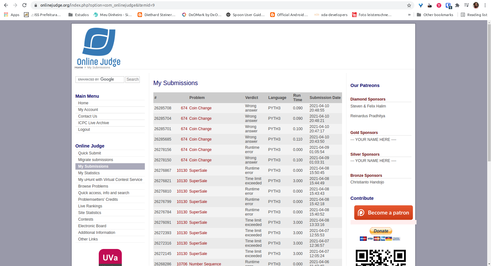

# Análise e Complexidade de Algoritmos

**Rodrigo Seidel**

**PPComp — Campus Serra, Ifes**

**2021-03**

## Breve explicação de como a técnica indicada foi utilizada

O problema consiste em identificar as diferentes maneiras de compor um valor utilizando as moedas de 1, 5, 10, 25 e 50 centavos.

A primeira dúvida resolvida foi confirmar se o valor 6, por exemplo, teria 3 (1+1+1+1+1+1; 1+5; 5+1) ou 2 (5+1 seria igual a 1+5, portanto seria considerado apenas 1) maneiras diferentes. Através de testes no uDebug foi confirmado 2 maneiras distintas.

A técnica de programação dinâmica foi utilizada na montagem de uma matriz, na qual as linhas representam os valores pesquisados e as colunas representam as moedas disponíveis. Ela é inicializada de forma que a linha 0 é populada toda com o valor 1, o que representa que o existe apenas 1 maneira de se compor o valor 0 com qualquer uma das moedas, ou seja, sem moedas.

Dado um valor, percorre-se de 1 até aquele valor em questão, buscando-se a quantidade de maneiras que pode-se compor cada valor intermediário, sendo que as formas possíveis vão se acumulando (aproveitando-se de cálculo feito previamente), porém as moedas disponíveis vão diminuindo. Ao final o valor que chegamos é a quantidade distinta de formas de compor o valor.

Consegui apenas o resultado "Wrong answer", conforme imagem a seguir (primeiro item da lista), entretanto, obtive sucesso nos 2 casos de teste no uDebug ao executar o código localmente.

## Análise da complexidade de tempo do programa desenvolvido

Quantidade de valores: N
Quantidade moedas: 5
Prepara o cache: 1 x n+1 - cache com quantidade de linhas de 0 até o valor máximo inserido no input

Busca qtd maneiras: N*(n+1) + (n+1)

Foram desconsiderados custos irrelevantes, como atribuição de váriáveis, lista, etc, pois têm custo 1 (https://wiki.python.org/moin/TimeComplexity).

\begin{equation}
T(n) =
  \begin{cases}
    1 & \text{se}~n = 1 \\
    N*(n+1) + (n+1) & \text{caso contrário}
  \end{cases}
\end{equation}

Avaliando o retorno no Wolfram Alpha, entendi que a complexidade do algoritmo ficou em O(n²).

## Outras informações que o autor julgar apropriadas para o entendimento do trabalho realizado
