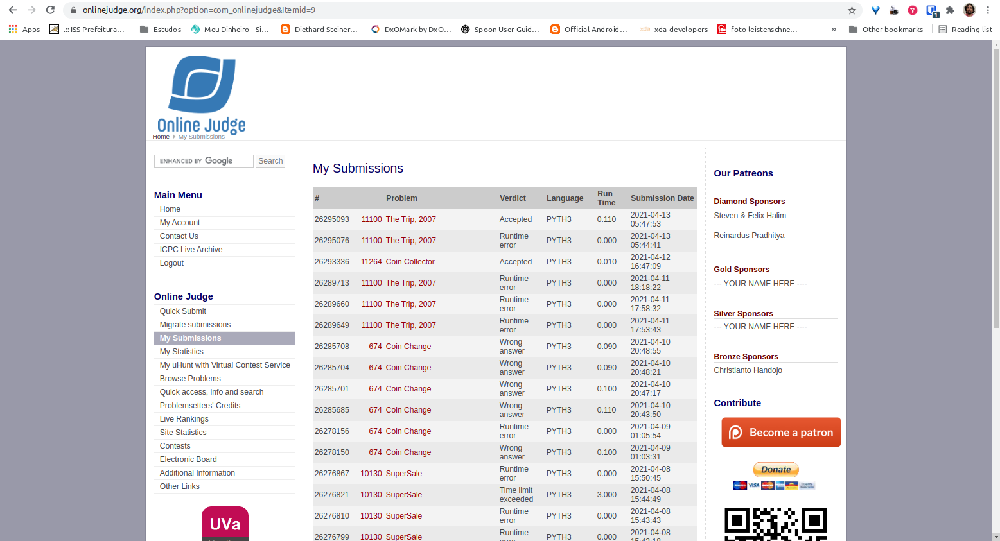

# Análise e Complexidade de Algoritmos

**Rodrigo Seidel**

**PPComp — Campus Serra, Ifes**

**2021-03**

## Breve explicação de como a técnica indicada foi utilizada

Após a entrada de dados de cada caso de teste, as bolsas são ordenadas de maneira crescente. 

Em seguida, para cada caso de teste é feita uma leitura em toda lista de bolsas para se identificar a quantidade k de bolsas que teremos ao juntarmos umas nas outras. Com essa quantidade k em mãos, é feita a leitura da lista de bolsas novamente, para cada identificarmos quais bolsas colocaremos em cada k.

Entendo que a propriedade de escolha gulosa trata-se deste k determinado, pois com ele, lê-se a lista de bolsas novamente (k vezes), realizando saltos de tamanho k na lista, de forma que a cada salto uma bolsa será inserida dentro da outra, e a cada leitura completa da lista finalizada avança-se uma posição nela, repetindi-se o processo, até que as k vezes se finalize.

Consegui o resultado "Accepted", conforme imagem a seguir (primeiro item da lista).

## Análise da complexidade de tempo do programa desenvolvido

Número de casos de Teste: T
Número de bolsas: n
Primeira leitura da lista de bolsas: n
Segunda leitura da lista de bolsas: n/k (k depende das características da entrada)

T*(n + (n/k))

A ordenação aplicada tem complexidade conhecida de O(n log n).

Foram desconsiderados custos irrelevantes, como atribuição de váriáveis, lista, etc, pois têm custo 1 (https://wiki.python.org/moin/TimeComplexity).

\begin{equation}
T(n) =
  \begin{cases}
    1 & \text{se}~n = 1 \\
    T*(n + (n/k) & \text{caso contrário}
  \end{cases}
\end{equation}

Avaliando o retorno no Wolfram Alpha, entendi que a complexidade do algoritmo ficou em O(n).

## Outras informações que o autor julgar apropriadas para o entendimento do trabalho realizado
