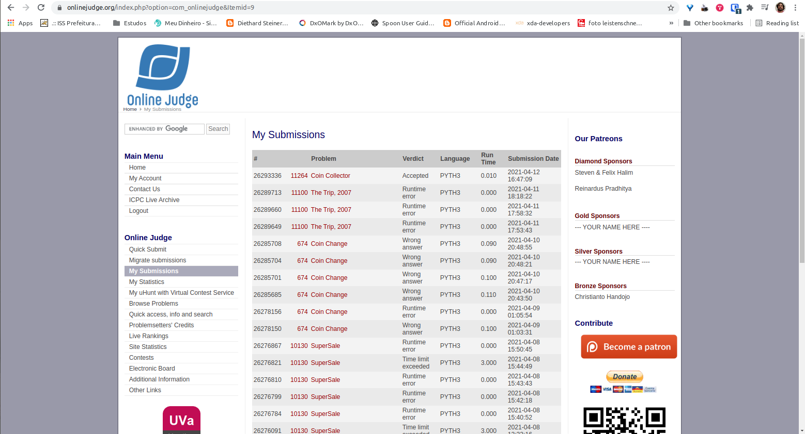

# Análise e Complexidade de Algoritmos

**Rodrigo Seidel**

**PPComp — Campus Serra, Ifes**

**2021-03**

## Breve explicação de como a técnica indicada foi utilizada

Após a entrada de dados, que já é feita ordenada de maneira crescente é feito o processamento dos casos de teste.

Entendo que a propriedade de escolha gulosa trata-se do uso do valor da moeda seguinte a que está se avaliando "V", de forma que, a moeda atual "A" será considerada na contagem quando adicionando-se o valor de "A" à soma de todas as moedas consideradas anteriormente tivermos um valor menor que "V".

Foi obtido o resultado "Accepted", conforme imagem a seguir (primeiro item da lista).

## Análise da complexidade de tempo do programa desenvolvido

Número de casos de Teste: T
Número de tipos de moedas: n
Leitura da lista de moedas inseridas: T*n

Foram desconsiderados custos irrelevantes, como atribuição de váriáveis, lista, etc, pois têm custo 1 (https://wiki.python.org/moin/TimeComplexity).

\begin{equation}
T(n) =
  \begin{cases}
    1 & \text{se}~n = 1 \\
    T*n & \text{caso contrário}
  \end{cases}
\end{equation}

Desta forma entendo que a complexidade do algoritmo ficou em O(n).

## Outras informações que o autor julgar apropriadas para o entendimento do trabalho realizado
